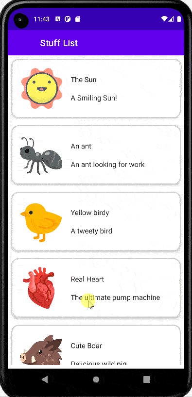

# Stuff App - List To Detail Navigation

Simple app to demonstrate navigation without navController NavHost.
The App displays a list of things screen, on click of an item a detailed screen is displayed 
We aso use a viewModel and uiState.
Data is kept in Array loaded into viewModel
UiState observes the List, a boolean flag and the current selected/default item

Some goals
- Use navigate with out navController
- Use viewmodel
- use uiState
- use BackHandler

## Codelab Screenshot

  

ref: stuff-app-android-kotlin-compose
