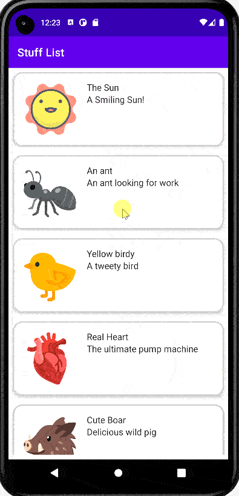
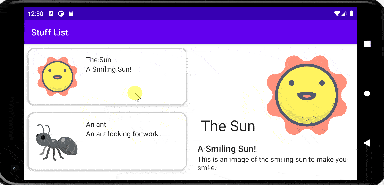

# Stuff App - List To Detail Navigation and Adaptive Layout

Simple app to demonstrate navigation without navController NavHost.
and to demonstrate adaptive layout.

The App displays a list of things(stuff) screen, on click of an item a detailed screen is displayed 
We aso use a viewModel and uiState.
Data is kept in Array loaded into viewModel
UiState observes the List, a boolean flag and the current selected/default item
On bigger screen or in screen rotate the Detail will be displayed next to the list

Some goals
- Use navigate with out navController
- Use viewmodel
- use uiState
- use BackHandler
- https://github.com/lixoten/stuff-app-android-kotlin-compose/tree/navigation

Some goals
- Apply the concept of adaptive layout.
- https://github.com/lixoten/stuff-app-android-kotlin-compose/tree/adaptive_layout

## Codelab Screenshot

  
  

ref: stuff-app-android-kotlin-compose
